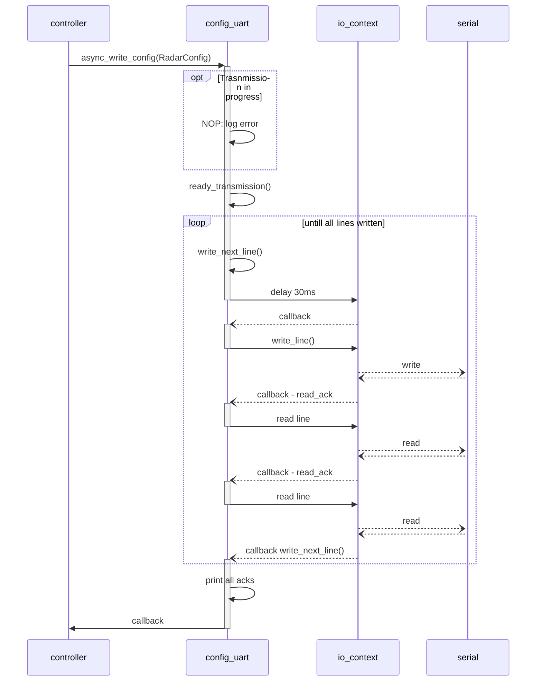

# wb-exercise

Project goal: to demonstrate:
> "setting up a hardware test bed and implementing a proof-of-concept integration for a Mistral 60GHz AoPCB module (mmWave device)".

## Running the image

### Prerequisites

✅ Raspberry Pi with Mistral devboard connected

✅ Access to the `ghcr.io/sebastianbrockl` registry

✅ Pull the latest image with:
```bash
docker pull ghcr.io/sebastianbrockl/mistral-demo:latest
```

### Running the container using `run-demo.sh`

use the provided script `run-demo.sh` to conviniently pull and run the latest build image.

The script assumes that:
- You are logged in to the prerequisite docker registry.
- Your user is member of the groups `docker` & `dialout`. To be able to run docker commands and access serial devices without `sudo`, respectively.


The script will attempt to:

1. Determine the serial devices the Mistral devboard is mounted as.
2. Pull the latest build image.
3. run the build image as an ephemeral container.
	1. Mount the detected devices.
	2. provide reasonable default configurations to the contained executable.


### Ignore this section for now as it is outdated and errouneus

`TODO cleanup`

assuming the mistral devboards UART interfaces are mounted at

```
/dev/serial/by-id/usb-Silicon_Labs_CP2105_Dual_USB_to_UART_Bridge_Controller_01448E45-if00-port0
/dev/serial/by-id/usb-Silicon_Labs_CP2105_Dual_USB_to_UART_Bridge_Controller_01448E45-if01-port0
```

for the config and data ports respectively.

Run the container with:

```bash
docker run --rm -it \
  -p 9002:9002 \
  --device=/dev/serial/by-id/usb-Silicon_Labs_CP2105_Dual_USB_to_UART_Bridge_Controller_01448E45-if00-port0 \
  --device=/dev/serial/by-id/usb-Silicon_Labs_CP2105_Dual_USB_to_UART_Bridge_Controller_01448E45-if01-port0 \
  ghcr.io/sebastianbrockl/mistral-demo:latest

docker run --rm -p 9002:9002 ghcr.io/sebastianbrockl/mistral-demo:latest
```

You can override the containers default CLI arguments like so:

```bash
docker run --rm -it \
    -v /path/to/config:/some-path/some-config.cfg \
    --device=/dev/ttyUSB0 \
    --device=/dev/ttyUSB1 \
    ghcr.io/sebastianbrockl/mistral-demo:latest \
    --config_path /some-path/some-config.cfg \
    --read_port /dev/ttyUSB0 \
    --write_port /dev/ttyUSB1 \
    --read_baudrate 115200 \
    --write_baudrate 115200
```


The container will open a websocket server on port 9002 for broadcasting TLV data

## build prerequisites

✅ Ensure you have docker with buildx installed

✅ The Docker daemon running

✅ Write access to the `hcr.io/sebastianbrockl` docker registry for pushing the generated images

🛠 **Note!** Im using my local docker registry, you can override my defaults to any registry of your choice with the `env` variable `LOCAL_DOCKER_REGISTRY`, or by editing the `Makefile` directly.

```bash
sudo apt-get update && 
sudo apt-get install -y \
    g++ \
    gcc-arm-linux-gnueabihf \
    cmake \
    git \
    libboost-all-dev \
    libwebsocketpp-dev \
    libspdlog-dev \
    nlohmann-json3-dev
```

You can build the project conventionally using cmake, or use the provided `make` helpers.

### clean 

```bash
make clean
```

### Build executable and docker image
```bash
make build
```

### Push the built docker image
```
make push
```

## Project status

### Done

**Tooling**
 - Get c++ cross-compilation toolchain up and running
 - Get docker cross build toolchain up and running
 - implement build and deployment tooling via scripts and make
 
 **Websockets**
 - implement Websocket server with simple session mangement

 **UART config**
 - implement handler for loading configs
 - implment asynch configuration write (**not verified**)
 - implment model for loading configuration files
 - implment model for mapping configuration to JSON

 **UART data stream**
 - implment handler for asynchronoulsy reading data stream
 - implment logic for detecting and parsing message frames (**not verified**)
 - implment models for deserializing message frame TLV's (**not verified**)

 **Application state control**
 - adopt boost.asio asynch mechanisms (**ongoing**)
 - enable configuration over runtime CLI arguments
 - clean program exit on SIGTERM


 ### `TODO`

**UART config**
 - verify configuration correctnes
 - implement configuration reload
 - implement recieving new radar configuration over http

 **UART data stream**
 - **successfully open sensor data stream**
 - **verify message frame detection**
 - implement full bytestream -> TLV deserialization
 - implement TLV -> JSON mapping
 - finalize JSON broadcast for open connections


### UART features

#### Config worite sequence

The mistral device uses

1 stopbit
no parity
baudrate config 115200
baudrate data   921600

